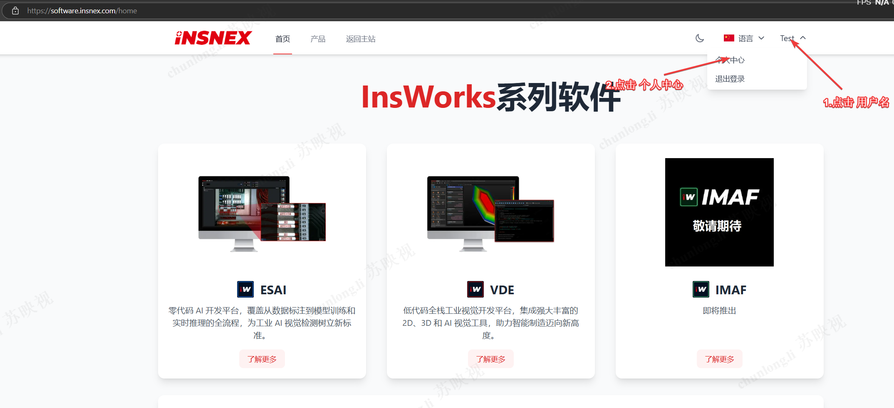
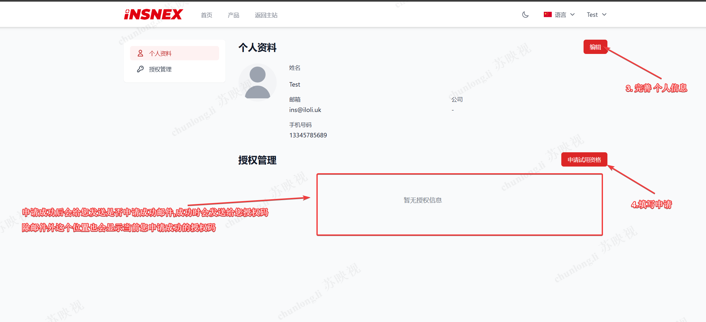
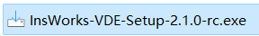
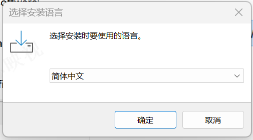
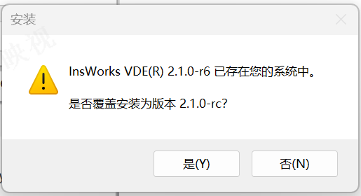
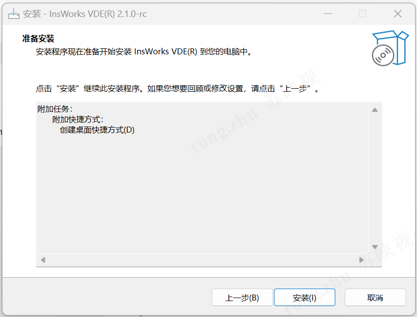
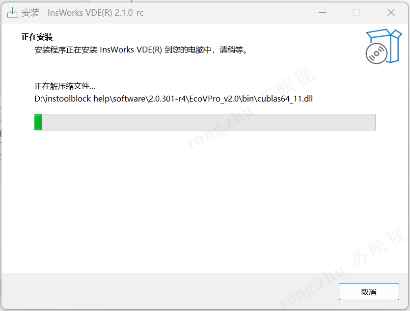
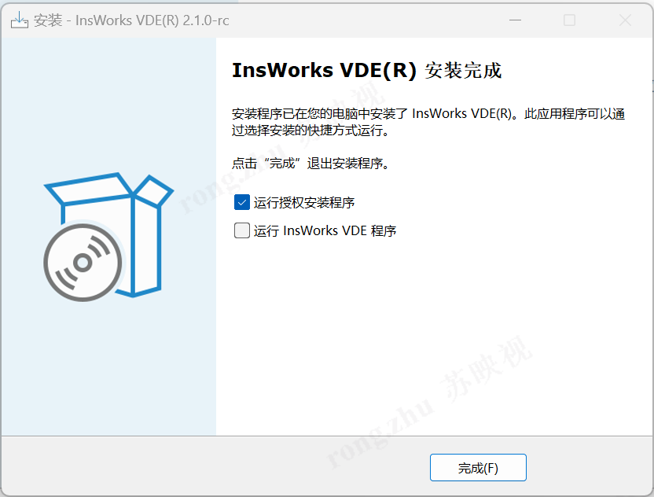
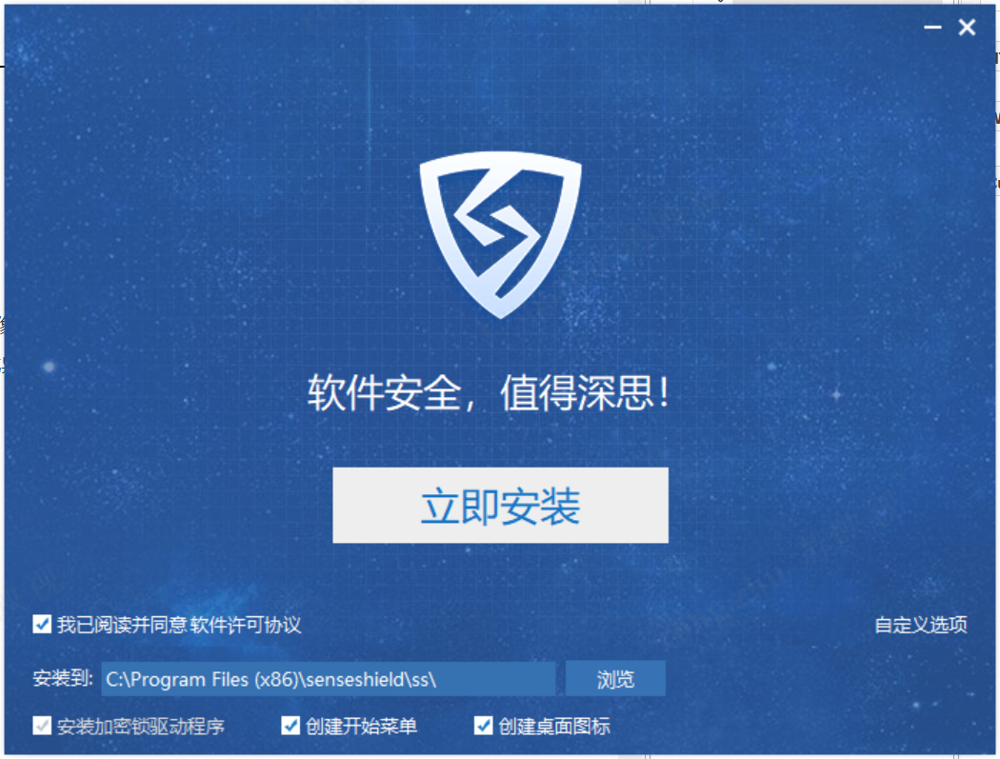
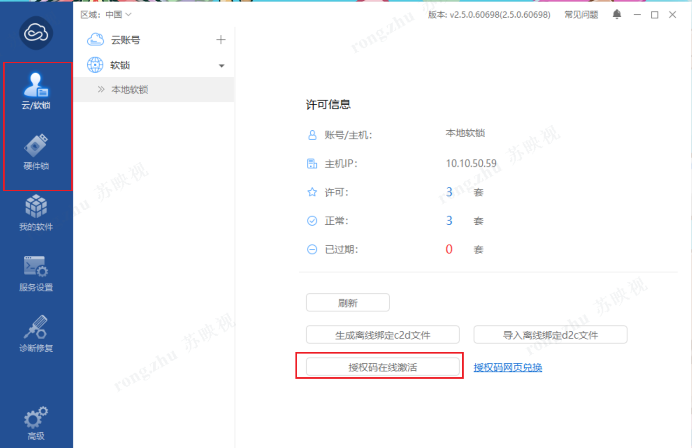

# VDEApp - 工业视觉检测平台

<div align="center">


一个基于 .NET Framework 的开源工业视觉检测应用程序，支持 2D/3D 视觉、AI 深度学习检测等功能。

[功能特性](#-功能特性) • [快速开始](#-快速开始) • [架构设计](#-架构设计) • [文档](#-文档) • [贡献指南](#-贡献指南)

</div>

---

## 📖 项目简介

VDEApp (Visual Detection Engine Application) 是一个专业的工业视觉检测平台，旨在为制造业提供高效、灵活的视觉检测解决方案。本项目采用现代化的架构设计，支持多种工业相机、丰富的检测算法，并具有良好的扩展性。

### 🎯 设计目标

- **易用性**：直观的用户界面，降低学习成本
- **灵活性**：支持多种相机和检测算法，适应不同应用场景
- **可扩展**：插件化架构，易于添加新功能和自定义模块
- **高性能**：优化的图像处理流程，支持实时检测
- **开源友好**：完善的文档和测试，欢迎社区贡献

### 🏭 适用场景

- 工业自动化视觉检测
- 质量控制与缺陷检测
- 2D/3D 测量与识别
- AI 深度学习应用
- 多相机协同工作
- 生产线实时监控

---

## ✨ 功能特性

### 核心功能

#### 📷 多相机支持

- **虚拟相机**：用于测试和演示，无需硬件即可运行
- **华睿相机**：支持华睿工业相机全系列
- **大华相机**：支持大华工业相机全系列
- **CHVS 相机**：支持 CHVS 视觉系统
- **可扩展驱动**：通过 `ICamera` 接口轻松集成自定义相机

#### 🔄 灵活的任务流程

- **三阶段流程**：取像 (Acquire) → 标定 (Calibration) → 检测 (Inspection)
- **多种执行模式**：
  - 单次运行：执行单个任务
  - 批量执行：任务组批量处理
  - 循环运行：持续监测模式
- **异步执行**：支持异步任务，不阻塞 UI
- **取消控制**：支持优雅停止运行中的任务

#### 🎨 强大的视觉处理能力

基于 Insnex Vision SDK 提供全栈视觉处理能力：

- **2D 视觉处理**：图像分析、特征提取、模式匹配
- **3D 视觉处理**：三维重建、点云处理、深度测量
- **AI 深度学习**：缺陷检测、分类识别、目标跟踪
- **图像增强**：预处理、滤波、对比度调整
- **颜色处理**：色彩分析、颜色匹配

#### 💾 数据管理

- **项目管理**：
  - 创建、打开、保存项目
  - 项目配置持久化
  - 最近项目历史记录
- **图像管理**：
  - 自动保存原图和截图
  - 分离存储、自动归档
  - 自定义保存策略
- **生产数据**：
  - 检测结果记录
  - 生产统计报表
  - 数据导出功能

#### 🌐 通信接口

- **TCP/IP 通信**：
  - TCP 服务器和客户端
  - 命令解析器
  - 实时状态反馈
- **远程控制**：支持通过网络远程控制检测流程
- **可扩展协议**：易于添加其他通信方式（Serial、Modbus、OPC-UA 等）

#### 🌍 多语言支持

- 中文 (zh-CN)
- 英文 (en-US)
- 运行时动态切换
- 易于扩展其他语言

### 🔧 技术亮点

- 🎨 **现代化 UI**：基于 AntdUI 组件库，界面美观易用
- 🏗️ **依赖注入**：使用 Microsoft.Extensions.DependencyInjection，提升可测试性
- 🧪 **单元测试**：xUnit + Moq + FluentAssertions 完整测试框架
- 📊 **日志系统**：log4net 全程记录，支持多种输出方式
- 🔄 **异步编程**：Task/async/await 模式贯穿始终
- 🗂️ **配置管理**：JSON 配置文件，易于维护
- 🎯 **事件驱动**：组件解耦良好，通过事件通信
- 🔌 **插件化设计**：相机驱动、检测算法可灵活扩展

---

## 🚀 快速开始

### 前置要求

#### 软件要求

- **操作系统**：Windows 10/11 (64位)
- **.NET Framework**：4.7.2 或更高版本
- **IDE**：Visual Studio 2019+ 或 Visual Studio Code
- **Insnex Vision SDK**：需要安装允许SDK二次开发的InsWorks VDE的版本

#### InsWorks VDE授权获取方式

##### 1、商用试用版

点击[InsWorks系列软件官网](https://software.insnex.com/home)，根据图片步骤申请获取授权码。





#### InsWorks VDE软件安装步骤

以下是该软件的安装步骤：

1. 下载软件安装包并解压以获取安装程序：

2. 以下是该软件的安装步骤：

   1. 下载软件安装包并解压以获取安装程序：

   

   1. 双击打开程序进行安装，首先选择安装语言。

   

   如果你的计算机上有旧版本的软件，建议在安装新版本之前直接卸载旧版本。

   

   3. 开始安装程序。

   

   

   4.安装完成后，选择运行授权安装程序并且单击完成，系统将会自动安装本InsWorks VDE软件搭配的加密软件。

   

#### 加密软件安装

以下是加密软件的安装步骤：

1.选择运行授权安装程序后，系统进入加密软件安装流程。



2.加密软件可以通过云/软锁或硬件锁激活。 一旦激活，加密软件将自动绑定到InsWorks VDE软件以正常运行。



3.要解除绑定或进行其他操作，可以直接在加密软件中执行。

#### 环境变量

确保设置了以下环境变量：

```
INSWORKS_VDEROOT=C:\Program Files\Insnex\InsWorks VDE
```

### 安装

#### 方式 1：从源码构建

```bash
# 1. 克隆仓库
git clone https://github.com/InsWorks-Software/VDEApp.Winform.git
cd vdeapp.winforms

# 2. 在 Visual Studio 中打开解决方案
# 双击 VDEApp.sln 文件

# 3. 还原 NuGet 包（在 Visual Studio 中自动进行）
# 右键解决方案 → 还原 NuGet 包

# 4. 构建项目
# 按 Ctrl + Shift + B 或者在菜单中选择"生成" → "生成解决方案"
```

#### 方式 2：使用命令行构建

```bash
# 使用 MSBuild 构建
cd VDEApp.WinForms
msbuild VDEApp.sln /p:Configuration=Release

# 或者使用 dotnet CLI
dotnet build VDEApp/VDEApp.csproj --configuration Release
```

### 运行

#### 方式 1：Visual Studio 调试

1. 在 Visual Studio 中打开 `VDEApp.sln`
2. 按 `F5` 运行（调试模式）
3. 或按 `Ctrl + F5` 运行（非调试模式）

#### 方式 2：直接运行编译后的程序

```bash
cd Output
VDEApp.exe
```

### 🎓 第一个检测项目

#### 1. 创建新项目

1. 启动应用程序
2. 点击菜单栏 "文件" → "新建项目"
3. 输入项目名称（例如：MyFirstProject）
4. 选择保存路径（默认为 `WorkRoot/`）
5. 点击"确定"

#### 2. 配置相机

1. 点击菜单栏 "设备" → "相机管理"
2. 点击"添加相机"
3. 选择相机类型（建议初次使用选择"虚拟相机"）
4. 配置相机参数：
   - 设置相机名称
   - 配置图像路径（虚拟相机）
   - 设置曝光、增益等参数
5. 点击"保存"

#### 3. 创建检测任务

1. 在主界面左侧"任务列表"中，右键点击"新建任务"
2. 输入任务名称（例如：Task01）
3. 双击任务进入任务编辑界面

#### 4. 配置任务流程

**取像节点 (Acquire)**：

1. 选择之前配置的相机
2. 设置触发模式（软触发/硬触发）
3. 配置图像预处理参数

**标定节点 (Calibration)** [可选]：

1. 选择标定方法（棋盘格、圆点等）
2. 导入标定图像
3. 执行标定并保存结果

**检测节点 (Inspection)**：

1. 添加检测工具（模板匹配、边缘检测、颜色识别等）
2. 配置检测参数和 ROI 区域
3. 设置判定标准（OK/NG）

#### 5. 运行检测

1. 点击主界面工具栏的"运行"按钮
2. 查看实时检测结果
3. 在"生产记录"中查看历史数据
4. 检查"日志"窗口了解运行状态

---

## 🏗️ 架构设计

VDEApp 采用**改良的 MVC 架构**，结合**依赖注入**和**事件驱动**设计模式，确保代码的可维护性和可扩展性。

### 分层架构

```
┌─────────────────────────────────────┐
│         View Layer (视图层)          │
│   WinForms UI + AntdUI Components   │
│   - 用户交互                         │
│   - 数据展示                         │
│   - 事件触发                         │
└──────────────┬──────────────────────┘
               │ Events & Data Binding
               ▼
┌─────────────────────────────────────┐
│     Controller Layer (控制器层)      │
│   Business Logic Orchestration      │
│   - ProjectController               │
│   - TaskController                  │
│   - DeviceController                │
│   - DisplayController               │
│   - SaveImageController             │
│   - TcpCommunicationController      │
└──────────────┬──────────────────────┘
               │ Operates On
               ▼
┌─────────────────────────────────────┐
│       Model Layer (模型层)           │
│   Business Entities & Logic         │
│   - TaskModel                       │
│   - ProjectModel                    │
│   - ProductionDataModel             │
│   - Node Models (Acquire/Inspect)   │
└──────────────┬──────────────────────┘
               │ Persisted To
               ▼
┌─────────────────────────────────────┐
│   Config Layer (配置持久化层)         │
│   - JSON Configuration Files        │
│   - ToolBlocks (Vision Algorithms)  │
│   - Database (Future)               │
└─────────────────────────────────────┘
```

### 核心组件与设计模式

| 组件                           | 职责                             | 设计模式             |
| ------------------------------ | -------------------------------- | -------------------- |
| **ProjectController**          | 项目生命周期管理、配置加载保存   | Singleton            |
| **TaskController**             | 任务执行调度、并发控制、状态管理 | Singleton            |
| **DeviceController**           | 设备管理、相机驱动抽象           | Singleton + Factory  |
| **DisplayController**          | 显示控制、窗口布局管理           | Singleton + Observer |
| **SaveImageController**        | 异步图像保存队列                 | Producer-Consumer    |
| **TcpCommunicationController** | 网络通信、命令解析               | Singleton            |
| **TaskModel**                  | 任务流程编排                     | Composite            |
| **ICamera**                    | 相机驱动抽象                     | Strategy + Plugin    |

### 依赖注入容器

使用 `Microsoft.Extensions.DependencyInjection` 进行依赖管理：

```csharp
// Program.cs 中配置服务
var services = ServiceConfigurator.ConfigureServices();
ServiceLocator.Initialize(services);

// 注册的单例服务：
- GlobalConfig
- ProjectController
- TaskController
- DeviceController
- DisplayController
- SaveImageController
- TcpCommunicationController
- LanguageController
```

### 数据流程

**典型的检测流程**：

```
用户点击"运行" (UI Event)
    ↓
TaskController.RunAsync()
    ↓
┌─────────────────────────────────────┐
│ 1. AcquireNode.Execute()            │
│    - 触发相机取像                    │
│    - 获取图像数据                    │
│    - 图像预处理                      │
└──────────────┬──────────────────────┘
               ▼
┌─────────────────────────────────────┐
│ 2. CalibrationNode.Execute()        │
│    - 坐标系标定 (可选)               │
│    - 图像矫正                        │
│    - 坐标转换                        │
└──────────────┬──────────────────────┘
               ▼
┌─────────────────────────────────────┐
│ 3. InspectionNode.Execute()         │
│    - 运行检测算法                    │
│    - 特征提取                        │
│    - 结果判定 (OK/NG)                │
└──────────────┬──────────────────────┘
               ▼
┌─────────────────────────────────────┐
│ 4. 结果处理与反馈                    │
│    - 保存图像到磁盘                  │
│    - 更新 UI 显示                    │
│    - 记录生产数据                    │
│    - 触发事件通知                    │
│    - TCP 通信反馈                    │
└─────────────────────────────────────┘
```

详细架构文档请参阅 [ARCHITECTURE_RECOMMENDATIONS.md](docs/ARCHITECTURE_RECOMMENDATIONS.md)

---

## 📁 项目结构

```
VDEApp.WinForms/
├── VDEApp/                          # 主应用程序 (130+ C# 文件)
│   ├── Attributes/                  # 自定义特性
│   │   └── InitializeDirectory.cs  # 目录初始化特性
│   │
│   ├── Commons/                     # 公共模块
│   │   ├── AppConstant.cs          # 应用常量定义
│   │   ├── AppPathRouter.cs        # 路径路由管理
│   │   └── AppModuleSingleton.cs   # UI 模块单例
│   │
│   ├── Configs/                     # 配置管理
│   │   ├── GlobalConfig.cs         # 全局配置
│   │   ├── CameraConfiguration.cs  # 相机配置
│   │   ├── TaskConfig.cs           # 任务配置
│   │   ├── SaveImageConfig.cs      # 图像保存配置
│   │   ├── Display/                # 显示配置
│   │   └── IConfig.cs              # 配置接口
│   │
│   ├── Controllers/                 # 控制器层 (业务逻辑)
│   │   ├── ProjectController.cs    # 项目管理
│   │   ├── TaskController.cs       # 任务执行控制
│   │   ├── DeviceController.cs     # 设备管理
│   │   ├── DisplayController.cs    # 显示控制
│   │   ├── SaveImageController.cs  # 图像保存
│   │   ├── TcpCommunicationController.cs  # TCP 通信
│   │   ├── LanguageController.cs   # 语言控制
│   │   └── CommandParser.cs        # 命令解析
│   │
│   ├── Devices/                     # 设备抽象层
│   │   ├── Cameras/                # 相机驱动
│   │   │   ├── ICamera.cs          # 相机接口
│   │   │   ├── InsVirtualCamera.cs # 虚拟相机
│   │   │   ├── InsCamera2DHuaray.cs # 华睿相机
│   │   │   ├── InsCamera2DDaHua.cs # 大华相机
│   │   │   └── CHVS/InsCameraCHVS.cs # CHVS 相机
│   │   ├── Attributes/             # 相机特性标注
│   │   ├── Datas/                  # 数据结构
│   │   ├── Enums/                  # 枚举定义
│   │   └── InsfwDeviceManager.cs   # 设备管理器
│   │
│   ├── Infrastructure/              # 基础设施
│   │   ├── ServiceConfigurator.cs  # DI 容器配置
│   │   └── ServiceLocator.cs       # 服务定位器
│   │
│   ├── LogModule/                   # 日志模块
│   │   ├── Log.cs                  # 日志封装
│   │   └── LogAppender.cs          # 自定义日志追加器
│   │
│   ├── Models/                      # 数据模型
│   │   ├── Languages/              # 多语言
│   │   ├── Operations/             # 操作模型
│   │   ├── Product/                # 生产数据
│   │   ├── Project/                # 项目模型
│   │   └── TaskNodes/              # 任务节点
│   │       ├── INode.cs            # 节点接口
│   │       ├── TaskModel.cs        # 任务模型
│   │       ├── AcquireNode.cs      # 取像节点
│   │       ├── CalibrationNode.cs  # 标定节点
│   │       └── InspectionNode.cs   # 检测节点
│   │
│   ├── Monitors/                    # 监控模块
│   │   ├── IMonitor.cs
│   │   ├── MonitorManager.cs
│   │   └── Cameras/
│   │       ├── CameraMonitor.cs
│   │       └── SaveImageMonitor.cs
│   │
│   ├── Utils/                       # 工具类
│   │   ├── Communication/          # 通信工具
│   │   │   ├── InsTcpClient.cs
│   │   │   └── InsTcpServer.cs
│   │   ├── Exceptions/             # 自定义异常
│   │   └── Memory/                 # 内存操作
│   │
│   ├── Views/                       # 视图层 (50+ 用户界面)
│   │   ├── Main/                   # 主界面组件
│   │   │   ├── UCTitleBar.cs       # 标题栏
│   │   │   ├── UCToolBar.cs        # 工具栏
│   │   │   ├── UCStatusBar.cs      # 状态栏
│   │   │   ├── UCProductDisplay.cs # 产品显示
│   │   │   └── ...
│   │   ├── Devices/Cameras/        # 相机管理界面
│   │   ├── Display/                # 显示配置界面
│   │   ├── Task/                   # 任务管理界面
│   │   ├── Project/                # 项目管理界面
│   │   ├── Tools/                  # 工具界面
│   │   ├── ReplayImages/           # 图像回放
│   │   └── Help/                   # 帮助界面
│   │
│   ├── MainForm.cs                  # 主窗体
│   ├── Program.cs                   # 程序入口
│   ├── App.config                   # 应用配置
│   ├── log4net.config               # 日志配置
│   └── packages.config              # NuGet 包配置
│
├── VDEApp.Tests/                    # 单元测试项目
│   ├── Controllers/                 # 控制器测试
│   │   ├── TaskControllerTests.cs
│   │   └── DeviceControllerTests.cs
│   ├── TestBase.cs                  # 测试基类
│   └── README.md                    # 测试指南
│
├── TCPClient/                       # TCP 客户端测试工具
│
├── Output/                          # 编译输出目录
│   ├── VDEApp.exe                  # 主程序
│   ├── Assemblies/                 # 第三方组件
│   │   ├── AntdUI.dll
│   │   ├── Cameras/                # 相机 SDK
│   │   └── Frameworks/             # 框架依赖
│   ├── Languages/                  # 语言文件
│   ├── Log/                        # 日志目录
│   └── WorkRoot/                   # 工作根目录
│
├── docs/                            # 文档目录
│   └── ARCHITECTURE_RECOMMENDATIONS.md  # 架构优化建议
│
├── README.md                        # 本文档
├── CONTRIBUTING.md                  # 贡献指南
├── LICENSE                          # MIT 许可证
└── .editorconfig                    # 编辑器配置
```

---

## 🛠️ 技术栈

### 核心框架

- **.NET Framework**: 4.7.2
- **C#**: 8.0 (Preview Features)
- **Windows Forms**: 传统桌面应用框架

### UI 组件

- **AntdUI** 2.1.13: 现代化 UI 组件库

### 视觉处理引擎 (Insnex Vision SDK)

- `Insnex.Vision2D.Core`: 2D 视觉核心
- `Insnex.Vision2D.AI`: AI 深度学习模块
- `Insnex.Vision2D.Color`: 颜色处理
- `Insnex.Vision3D.Core`: 3D 视觉核心
- `Insnex.Vision3D.Display`: 3D 显示
- `Insnex.AcqFifo`: 图像采集 FIFO
- `Insnex.ImageEnhancement`: 图像增强
- `Insnex.ToolEditor`: 工具编辑器

### 第三方 NuGet 包

```xml
<package id="Newtonsoft.Json" version="13.0.4" />
<package id="log4net" version="3.2.0" />
<package id="Microsoft.Extensions.DependencyInjection" version="9.0.10" />
```

### 测试框架

```xml
<package id="xunit" version="2.9.3" />
<package id="Moq" version="4.20.70" />
<package id="FluentAssertions" version="6.12.0" />
<package id="coverlet.collector" version="6.0.4" />
```

---

## 📚 文档

### 用户文档

| 文档                            | 说明                   |
| ------------------------------- | ---------------------- |
| [快速开始](#-快速开始)          | 安装、运行和第一个项目 |
| [用户手册](docs/USER_MANUAL.md) | 详细的功能使用说明     |
| [FAQ](docs/FAQ.md)              | 常见问题解答           |

### 开发者文档

| 文档                                                 | 说明               |
| ---------------------------------------------------- | ------------------ |
| [依赖注入指南](VDEApp/Infrastructure/README_DI.md)   | DI 容器使用方法    |
| [测试指南](VDEApp.Tests/README.md)                   | 单元测试编写指南   |
| [架构优化建议](docs/ARCHITECTURE_RECOMMENDATIONS.md) | 架构改进方向       |
| [贡献指南](CONTRIBUTING.md)                          | 如何为项目贡献代码 |
| [API 文档](docs/API.md)                              | 核心 API 参考      |

### 相机驱动扩展

| 文档                                            | 说明                   |
| ----------------------------------------------- | ---------------------- |
| [相机驱动开发指南](docs/CAMERA_DRIVER_GUIDE.md) | 如何开发自定义相机驱动 |

---

## 🧪 测试

VDEApp 使用 **xUnit** 作为测试框架，配合 **Moq** 和 **FluentAssertions** 提供全面的单元测试。

### 运行测试

#### 使用 Visual Studio

1. 打开 "测试资源管理器" (Test Explorer)
2. 点击 "全部运行" 或选择特定测试运行

#### 使用命令行

```bash
# 运行所有测试
cd VDEApp.Tests
dotnet test

# 运行特定测试类
dotnet test --filter "FullyQualifiedName~TaskControllerTests"

# 运行特定测试方法
dotnet test --filter "FullyQualifiedName~RunAsync_ValidTask_ShouldExecuteSuccessfully"

# 生成代码覆盖率报告
dotnet test --collect:"XPlat Code Coverage"
```

### 测试覆盖率

| 组件                    | 测试数量 | 覆盖率   | 状态        |
| ----------------------- | -------- | -------- | ----------- |
| **TaskController**      | 6        | ~40%     | ✅ 进行中    |
| **DeviceController**    | 6        | ~60%     | ✅ 进行中    |
| **ProjectController**   | 0        | 0%       | ⏳ 待添加    |
| **DisplayController**   | 0        | 0%       | ⏳ 待添加    |
| **SaveImageController** | 0        | 0%       | ⏳ 待添加    |
| **总计**                | **12**   | **~15%** | 🎯 目标 70%+ |

### 测试规范

#### 测试命名规范

```csharp
MethodName_Scenario_ExpectedBehavior
```

**示例**：

```csharp
[Fact(DisplayName = "RunAsync 应该成功执行任务")]
public async Task RunAsync_ValidTask_ShouldExecuteSuccessfully()
{
    // Arrange - 准备测试数据和环境
    var taskName = "TestTask";

    // Act - 执行被测试的方法
    var result = await _taskController.RunAsync(taskName);

    // Assert - 验证结果
    result.Should().BeTrue();
}
```

#### AAA 模式

所有测试都遵循 **Arrange-Act-Assert** 模式：

1. **Arrange**: 准备测试数据和依赖
2. **Act**: 执行被测试的方法
3. **Assert**: 验证结果是否符合预期

详细测试指南请参阅 [VDEApp.Tests/README.md](VDEApp.Tests/README.md)

---

## 🤝 贡献指南

我们欢迎所有形式的贡献！无论是报告 Bug、提出新功能建议，还是提交代码改进。

### 如何贡献

#### 1. Fork 并克隆仓库

```bash
# Fork 本仓库到你的账户
# 然后克隆到本地
git clone https://github.com/YOUR_USERNAME/VDEApp.Winform.git
cd vdeapp.winforms
```

#### 2. 创建功能分支

```bash
# 创建并切换到新分支
git checkout -b feature/your-amazing-feature

# 或者修复 Bug
git checkout -b bugfix/fix-camera-issue
```

#### 3. 开发和测试

```bash
# 进行代码修改
# ...

# 运行测试确保没有破坏现有功能
cd VDEApp.Tests
dotnet test

# 添加新的单元测试覆盖你的代码
```

#### 4. 提交更改

```bash
# 添加修改的文件
git add .

# 提交（遵循 Conventional Commits 规范）
git commit -m "feat: add support for XXX camera"
git commit -m "fix: resolve issue with image saving"
git commit -m "docs: update README with new feature"
```

#### 5. 推送并创建 Merge Request

```bash
# 推送到你的 Fork
git push origin feature/your-amazing-feature

# 在 GitLab 上创建 Merge Request
```

### 提交规范 (Conventional Commits)

我们使用 [Conventional Commits](https://www.conventionalcommits.org/) 规范：

| 类型       | 说明      | 示例                                           |
| ---------- | --------- | ---------------------------------------------- |
| `feat`     | 新功能    | `feat: add Basler camera support`              |
| `fix`      | Bug 修复  | `fix: resolve memory leak in image processing` |
| `docs`     | 文档更新  | `docs: add camera driver guide`                |
| `style`    | 代码格式  | `style: format code with EditorConfig`         |
| `refactor` | 重构      | `refactor: extract camera factory`             |
| `test`     | 测试相关  | `test: add tests for TaskController`           |
| `chore`    | 构建/工具 | `chore: update NuGet packages`                 |
| `perf`     | 性能优化  | `perf: optimize image loading`                 |

### 代码规范

#### C# 编码规范

- 遵循 [Microsoft C# 编码规范](https://docs.microsoft.com/en-us/dotnet/csharp/fundamentals/coding-style/coding-conventions)
- 使用项目中的 `.editorconfig` 配置
- **命名约定**：
  - 类、方法、属性：`PascalCase`
  - 私有字段：`_camelCase` (带下划线前缀)
  - 参数、局部变量：`camelCase`
  - 常量：`PascalCase`

#### 文档注释

所有公共 API 必须包含 XML 文档注释：

```csharp
/// <summary>
/// 异步执行指定的任务
/// </summary>
/// <param name="taskName">要执行的任务名称</param>
/// <param name="cancellationToken">取消令牌</param>
/// <returns>如果任务成功执行返回 true，否则返回 false</returns>
/// <exception cref="ArgumentNullException">当 taskName 为 null 时抛出</exception>
public async Task<bool> RunAsync(string taskName, CancellationToken cancellationToken = default)
{
    // 实现...
}
```

#### 测试要求

- 新功能必须包含单元测试
- 测试覆盖率目标：70%+
- 使用 AAA 模式编写测试
- 使用 `DisplayName` 属性提供中文说明

### Merge Request 检查清单

在提交 MR 之前，请确保：

- [ ] 代码遵循项目编码规范
- [ ] 所有测试通过 (`dotnet test`)
- [ ] 添加了必要的单元测试
- [ ] 更新了相关文档
- [ ] 提交信息遵循 Conventional Commits
- [ ] 没有引入新的警告
- [ ] 代码已经过自我审查

详细的贡献指南请参阅 [CONTRIBUTING.md](CONTRIBUTING.md)

---

## 📊 日志系统

VDEApp 使用 **log4net** 提供完善的日志记录功能。

### 日志级别

| 级别      | 说明     | 使用场景           |
| --------- | -------- | ------------------ |
| **DEBUG** | 调试信息 | 开发阶段详细跟踪   |
| **INFO**  | 一般信息 | 正常运行的关键步骤 |
| **WARN**  | 警告信息 | 可恢复的异常情况   |
| **ERROR** | 错误信息 | 需要关注的错误     |
| **FATAL** | 致命错误 | 导致程序崩溃的错误 |

### 日志配置

日志配置位于 `log4net.config`：

```xml
<log4net>
  <appender name="RollingFileAppender" type="log4net.Appender.DailyRollingFileAppender">
    <file value="Log/log_" />
    <datePattern value="yyyyMMdd'.log'" />
    <appendToFile value="true" />
    <rollingStyle value="Date" />
    <staticLogFileName value="false" />
    <layout type="log4net.Layout.PatternLayout">
      <conversionPattern value="%date [%thread] %-5level %logger - %message%newline" />
    </layout>
  </appender>

  <root>
    <level value="INFO" />
    <appender-ref ref="RollingFileAppender" />
    <appender-ref ref="ConsoleAppender" />
  </root>
</log4net>
```

### 使用示例

```csharp
using VDEApp.LogModule;

public class TaskController
{
    public async Task RunAsync(string taskName)
    {
        Log.Info($"开始执行任务: {taskName}");

        try
        {
            // 执行任务...
            Log.Debug($"任务 {taskName} 正在执行中");
        }
        catch (Exception ex)
        {
            Log.Error($"任务 {taskName} 执行失败: {ex.Message}", ex);
            throw;
        }

        Log.Info($"任务 {taskName} 执行成功");
    }
}
```

### 日志文件位置

- **开发环境**: `VDEApp/bin/Debug/Log/log_yyyyMMdd.log`
- **生产环境**: `Output/Log/log_yyyyMMdd.log`

---

## 🔌 扩展开发

VDEApp 支持多种方式的扩展开发。

### 1. 相机驱动扩展

#### 实现自定义相机驱动

```csharp
using VDEApp.Devices.Cameras;

public class MyCustomCamera : ICamera
{
    public string Name { get; set; }
    public bool IsConnected { get; private set; }

    public bool Connect()
    {
        // 实现相机连接逻辑
        // ...
        IsConnected = true;
        return true;
    }

    public void Disconnect()
    {
        // 实现相机断开逻辑
        // ...
        IsConnected = false;
    }

    // 实现其他 ICamera 接口方法...
}
```

---

## 🐛 问题反馈

如果您遇到任何问题，请通过以下方式反馈：

### 提交 Issue

**GitLab Issues**: [提交 Issue](https://coderep.insnex.com/AduSkin/vdeapp.winforms/-/issues)

在提交 Issue 时，请包含以下信息：

#### Bug 报告模板

```markdown
**问题描述**
简洁清晰地描述遇到的问题

**复现步骤**
1. 打开 '...'
2. 点击 '....'
3. 滚动到 '....'
4. 看到错误

**预期行为**
描述您期望发生什么

**实际行为**
描述实际发生了什么

**截图**
如果适用，请添加截图帮助解释问题

**环境信息**
- OS: [例如 Windows 11]
- .NET Framework: [例如 4.7.2]
- VDEApp 版本: [例如 1.0.0]
- 相机类型: [例如 华睿 MV-CE013-50GM]

**日志文件**
请附上相关日志文件（位于 `Output/Log/`）

**附加信息**
任何其他有助于解决问题的信息
```

### 联系方式

- **邮件**: support@insnex.com
- **官网**: https://www.insnex.com

---

## 🛣️ 开发路线图

### 已完成 ✅

- [x] 基础 MVC 架构
- [x] 多相机支持（虚拟/华睿/大华/CHVS）
- [x] 任务流程管理
- [x] 2D/3D 视觉处理
- [x] TCP 通信接口
- [x] 多语言支持
- [x] 日志系统
- [x] 单元测试框架

### 进行中 🚧

- [ ] 提高测试覆盖率 (15% → 70%)
- [ ] 补充 API 文档
- [ ] 性能优化

### 计划中 📋

#### 短期 (1-3 个月)

- [ ] 添加更多相机驱动（Basler、HIKVision）
- [ ] 完善用户手册和 API 文档
- [ ] 引入接口抽象（IProjectController、ITaskController）
- [ ] 统一错误处理机制
- [ ] 数据库支持（SQLite/SQL Server）

#### 中期 (3-6 个月)

- [ ] Web 管理界面
- [ ] RESTful API 支持
- [ ] 历史数据分析和报表
- [ ] 引入 Repository 模式
- [ ] 优化单例使用
- [ ] 性能监控和诊断工具

#### 长期 (6-12 个月)

- [ ] 迁移到 .NET 6/7
- [ ] 跨平台支持（Linux/macOS）
- [ ] 云端部署支持
- [ ] 分布式多节点检测
- [ ] MVVM 架构重构
- [ ] AI 模型训练集成

---

## 📄 许可证

本项目采用 **MIT License** 开源许可证。详见 [LICENSE](LICENSE) 文件。

### MIT License 摘要

⚠️ **条件**：

- 必须包含许可证和版权声明

❌ **限制**：

- 不提供任何担保

---

## 📦 第三方依赖许可

本项目使用了以下第三方库和组件：

| 库                                           | 版本    | 许可证       | 用途                 |
| -------------------------------------------- | ------- | ------------ | -------------------- |
| **Insnex Vision SDK**                        | -       | 商业许可     | 2D/3D 视觉处理引擎   |
| **AntdUI**                                   | 2.1.13  | Apache-2.0   | 现代化 UI 组件库     |
| **Newtonsoft.Json**                          | 13.0.4  | MIT          | JSON 序列化/反序列化 |
| **log4net**                                  | 3.2.0   | Apache-2.0   | 日志记录框架         |
| **Microsoft.Extensions.DependencyInjection** | 9.0.10  | MIT          | 依赖注入容器         |
| **xUnit**                                    | 2.9.3   | Apache-2.0   | 单元测试框架         |
| **Moq**                                      | 4.20.70 | BSD-3-Clause | Mock 测试框架        |
| **FluentAssertions**                         | 6.12.0  | Apache-2.0   | 流式断言库           |
| **coverlet.collector**                       | 6.0.4   | MIT          | 代码覆盖率收集       |

**注意**: Insnex Vision SDK 需要单独的商业许可，详情请访问 [Insnex 官网](https://www.insnex.com)。

---

## 👥 贡献者

感谢所有为本项目做出贡献的开发者！

<!-- ALL-CONTRIBUTORS-LIST:START -->
<!-- 这里会自动生成贡献者列表 -->
<!-- ALL-CONTRIBUTORS-LIST:END -->

### 如何成为贡献者

1. Fork 本项目
2. 提交有价值的 Merge Request
3. 参与 Code Review
4. 帮助解答 Issues
5. 改进文档

---

## 🌟 Star History

如果这个项目对您有帮助，请给我们一个 ⭐ Star！

[](https://star-history.com/#AduSkin/vdeapp.winforms&Date)

---

## 🔗 相关链接

### 官方资源

- **Github 仓库**: https://github.com/InsWorks-Software/VDEApp.Winform.git
- **Insnex 官网**: https://www.insnex.com
- **技术支持**: support@insnex.com

### 社区资源

- **使用案例**: [查看案例](docs/CASE_STUDIES.md)
- **视频教程**: [观看教程](docs/TUTORIALS.md)

### 相关项目

- **Insnex Vision SDK**: 强大的视觉处理引擎
- **AntdUI**: 现代化的 WinForms UI 组件库

---

## 📈 项目统计

| 指标              | 数值    |
| ----------------- | ------- |
| **代码行数**      | 20,000+ |
| **C# 文件数**     | 130+    |
| **单元测试数**    | 12+     |
| **支持相机类型**  | 4 种    |
| **支持语言**      | 2 种    |
| **依赖 NuGet 包** | 10+     |
| **贡献者**        | 待统计  |

---

## ❓ FAQ (常见问题)

### Q1: 运行时提示找不到 Insnex Vision SDK？

**A**: 请确保已正确安装 InsWorks VDE 运行时，并设置环境变量 `INSWORKS_VDEROOT`。

### Q2: 如何添加自定义相机驱动？

**A**: 实现 `ICamera` 接口，并使用 `[Camera]` 特性标注，详见 [相机驱动扩展](#1-相机驱动扩展)。

### Q3: 支持哪些图像格式？

**A**: 支持常见格式如 BMP、JPG、png、TIFF 等。

### Q4: 如何提高检测性能？

**A**:

1. 优化 ROI 区域
2. 使用合适的图像分辨率
3. 启用多线程处理
4. 优化检测算法参数

### Q5: 是否支持 Linux 或 macOS？

**A**: 当前版本仅支持 Windows，跨平台支持在长期路线图中。

### Q6: 如何获取技术支持？

**A**:

1. 查阅文档和 FAQ
2. 在 GitLab Issues 提问
3. 发送邮件至 support@insnex.com

更多问题请查看 [完整 FAQ](docs/FAQ.md)

---

<div align="center">


## 💖 特别感谢

感谢以下组织和项目对本项目的支持：

[](https://www.insnex.com)
[](https://github.com/AntdUI/AntdUI)

---

**如果这个项目对您有帮助，请给我们一个 ⭐ Star！**

Made with ❤️ by [Insnex VDEApp Team](https://www.insnex.com)

Copyright © 2025 Insnex. All rights reserved.

</div>
